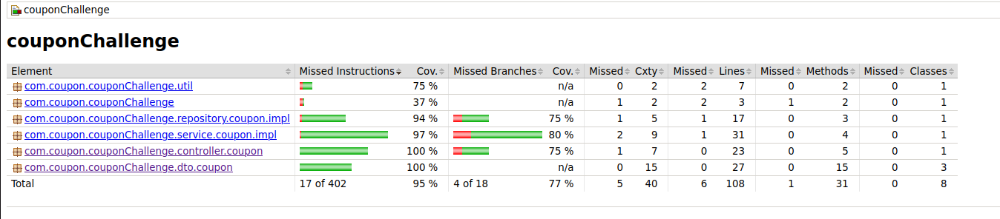

# COUPON CHALLENGE
***
El proyecto es un API que optimiza la cantidad de items que pueden obtenerse con un cupón de un monto especifico.


## Table of Contents
1. [Requisitos](#requisitos)
2. [Ejecución](#ejecución)
3. [Documentación del API](#documentación-api)
2. [Arquitectura](#arquitectura)
3. [Pruebas](#pruebas)
4. [Coverage](#coverage)
5. [Postman Collection](#postman-collection)


## Requisitos
***
El proyecto se encuentra dockerizado, por lo tanto para la ejecución es indispensable tener docker instalado y se recomienda tambien tener docker-compose.
Adicionalmente se puede desplegar en un servicio de cloud de ser necesario.


## Ejecución
***
Para la ejecución del proyecto se deben ejecutar en el directorio raiz del proyecto (Donde se encuentra el archivo DockerFile) los siguientes comandos :
```
$ docker build .
$ docker-compose up
```

## Documentación API
Para acceder a la documentación del API puede hacerlo desde este enlace en local: http://localhost:8080/swagger-ui.html
***
Para acceder a la documentación del API desplegada en el hosting de google puede hacerlo en este enlace: https://coupon-challenge-o52mrrclda-uc.a.run.app/swagger-ui/index.html

## Arquitectura
Para este proyecto se crea un API-REST en Spring que consume un API externa. 
También se ha desplegado en Google Cloud Run en la siguiente URL: https://coupon-challenge-o52mrrclda-uc.a.run.app


## Pruebas
Para ejecutar las pruebas ejecutar el siguiente comando:
```
$ mvn clean test
```
Esto creara en el directorio "target/site/jacoco/" un archivo "index.html" que contiene el reporte de coverage de las pruebas automaticas.


## Coverage


## Postman Collection
Se anexa la colección de postoman para pruebas: [here](https://github.com/DiegoAraque1207/coupon_challenge/blob/main/assets/Coupon%20Challenge.postman_collection.json)