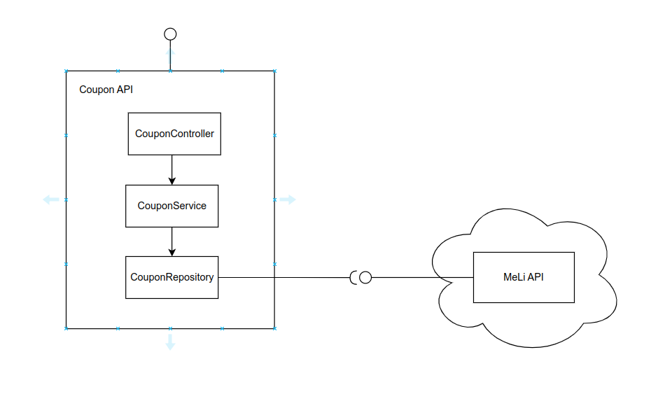

# COUPON CHALLENGE
***
El proyecto es un API que optimiza la cantidad de items que pueden obtenerse con un cupón de un monto especifico.


## Table of Contents
1. [Requisitos](#requisitos)
2. [Ejecución](#ejecución)
2. [Arquitectura](#arquitectura)


## Requisitos
***
El proyecto se encuentra dockerizado, por lo tanto para la ejecución es indispensable tener docker instalado y se recomienda tambien tener docker-compose.
Adicionalmente se puede desplegar en un servicio de cloud de ser necesario.


## Ejecución
***
Para la ejecución del proyecto se deben ejecutar en el directorio raiz del proyecto (Donde se encuentra el archivo DockerFile) los siguientes comandos :
```
$ docker build .
$ docker-compose up
```


## Arquitectura
Para este proyecto se crea un API-REST en Spring que consume un API externa. 
También se ha desplegado en Google Cloud Run en la siguiente URL: https://www.google.com.

